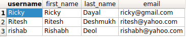

如何在Django ORM中使用 AND 查询？
++++++++++++++++++++++++++++++++++++++++++++++++++

.. image:: usertable.png

如果你正在使用 :code:`django.contrib.auth`，会发现有一个叫 :code:`auth_user` 的表。它包含 :code:`username`，:code:`first_name`， :code:`last_name` 等等字段。

如果你经常需要执行and操作，以寻找匹配多个条件的查询集

比如说你想所有的用户的firstname以字母'R'开始并且last name是以字母'D'开始。

Django 提供了三个选项

- :code:`filter(<condition_1>, <condition_2>)`
- :code:`queryset_1 & queryset_2`
- :code:`filter(Q(<condition_1>) & Q(<condition_2>))`

详细查询语句
-----------------------

以上条件下的SQL查询语句如下所示：

.. code-block:: sql

    SELECT username, first_name, last_name, email FROM auth_user WHERE first_name LIKE 'R%' AND last_name LIKE 'D%';

filter方法中多个条件联合查询的默认方式是AND，所以你可以直接使用。

.. code-block:: python

    queryset_1 = User.objects.filter(
        first_name__startswith='R',
        last_name__startswith='D'
    )

另外，你可以明确地在查询集上使用`&`操作符。

.. code-block:: python

    queryset_2 = User.objects.filter(
        first_name__startswith='R'
    ) & User.objects.filter(
        last_name__startswith='D'
    )

为了完全的定制化，你可以使用:code:`Q`对象。

.. code-block:: python

    queryset_3 = User.objects.filter(
        Q(first_name__startswith='R') &
        Q(last_name__startswith='D')
    )

    queryset_1
    <QuerySet [<User: Ricky>, <User: Ritesh>, <User: rishab>]>

你可以查看生成的查询语句并验证他们是否完全一致。

.. code-block:: ipython

    In [10]: str(queryset_2.query)
    Out[10]: 'SELECT "auth_user"."id", "auth_user"."password", "auth_user"."last_login", "auth_user"."is_superuser", "auth_user"."username", "auth_user"."first_name", "auth_user"."last_name", "auth_user"."email", "auth_user"."is_staff", "auth_user"."is_active", "auth_user"."date_joined" FROM "auth_user" WHERE ("auth_user"."first_name"::text LIKE R% AND "auth_user"."last_name"::text LIKE D%)'

    In [11]: str(queryset_1.query) == str(queryset_2.query) == str(queryset_3.query)
    Out[11]: True
