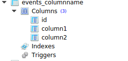

如何给模型字段指定列名？
=====================================================

给模型中的列命名可以通过给参数 :code:`db_column` 传入名字，如果我们没有传入这个参数，Django会通过我们给的字段名来创建行。

.. code:: python

    class ColumnName(models.Model):
        a = models.CharField(max_length=40,db_column='column1')
        column2 = models.CharField(max_length=50)

        def __str__(self):
            return self.a

如上所示，:code:`db_column` 比 :code:`field name` 的优先级更高。第一列被命名为collumn1而不是a。
