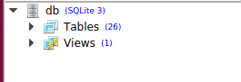

如何为数据库视图添加模型？
===============================================

数据库视图是一种由查询定义一种数据库的可搜索对象。虽然视图并不存储数据，有些人将视图视图当做"虚拟表",你可以和查询表一样查询视图。视图可以使用join联结两个或多个表的数据，而且只包含一部分的信息。这让他们很方便提取或隐藏复杂的查询。

在我们的SqliteStuio我们可以看到26张表并没有视图。

.. image:: before_view.png

让我们创建一个简单的视图。

.. code:: sql

        create view temp_user as select id, first_name from auth_user;

在视图被创建之后，我们可以看到有26张表和一个视图。

我们可以使用 :code:`managed = False` 和 :code:`db_table="temp_user"` 在我们的app中创建与之相关的模型：

.. code:: python

    class TempUser(models.Model):
        first_name = models.CharField(max_length=100)

        class Meta:
            managed = False
            db_table = "temp_user"

    // We can query the newly created view similar to what we do for any table.
    >>> TempUser.objects.all().values()
    <QuerySet [{'first_name': 'Yash', 'id': 1}, {'first_name': 'John', 'id': 2}, {'first_name': 'Ricky', 'id': 3}, {'first_name': 'Sharukh', 'id': 4}, {'first_name': 'Ritesh', 'id': 5}, {'first_name': 'Billy', 'id': 6}, {'first_name': 'Radha', 'id': 7}, {'first_name': 'Raghu', 'id': 9}, {'first_name': 'Rishabh', 'id': 10}, {'first_name': 'John', 'id': 11}, {'first_name': 'Paul', 'id': 12}, {'first_name': 'Johny', 'id': 13}, {'first_name': 'Alien', 'id': 14}]>
    // You cannot insert new reord in a view.
    >>> TempUser.objects.create(first_name='Radhika', id=15)
    Traceback (most recent call last):
    ...
    django.db.utils.OperationalError: cannot modify temp_user because it is a view

对有联合操作的视图，请参考：
http://books.agiliq.com/projects/django-admin-cookbook/en/latest/database_view.html?highlight=view
