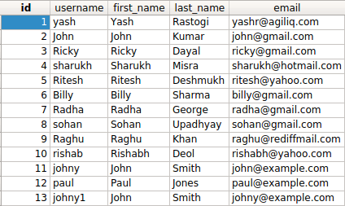

如何查找具有重复字段值的列？
==============================================

假如也想要所有的用户的 :code:`first_name` 匹配其他用户。

你可以使用以下技巧来找到重复的记录。

.. code-block:: python

    >>> duplicates = User.objects.values(
        'first_name'
        ).annotate(name_count=Count('first_name')).filter(name_count__gt=1)
    >>> duplicates
    <QuerySet [{'first_name': 'John', 'name_count': 3}]>

如果你想找到所有的记录，你也可以这样：

.. code-block:: python

    >>> records = User.objects.filter(first_name__in=[item['first_name'] for item in duplicates])
    >>> print([item.id for item in records])
    [2, 11, 13]
