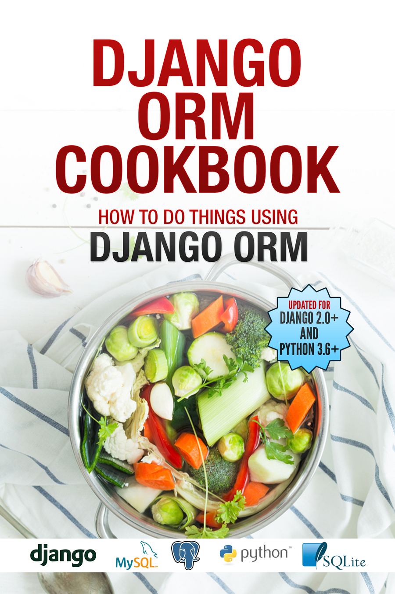

Django ORM Cookbook
+++++++++++++++++++++++

Django ORM Cookbook 是一本关于如何使用Django ORM和模型的手册。Django是一个"MTV"（模型-模板-视图）框架，本书提供 :code:`M` 模型部分的深入探究。

本书由50个"如何使用Django ORM/查询集/模型实现X"形式的问题组成。

原书链接：http://books.agiliq.com/projects/django-orm-cookbook/en/latest/

.. toctree::
   :maxdepth: 1

   introduction

查询和筛选
===============================================

.. toctree::
   :maxdepth: 1
   :numbered:

   query
   or_query
   and_query
   notequal_query
   union
   select_some_fields
   subquery
   f_query
   filefield
   join
   second_largest
   duplicate
   distinct
   query_relatedtool
   aggregation
   random
   func_expressions

增删改
===============================================

.. toctree::
   :maxdepth: 1
   :numbered:

   multiple_objects
   copy
   singleton
   update_denormalized_fields
   truncate
   signals
   datetime

排序
========================

.. toctree::
   :maxdepth: 1
   :numbered:

   asc_or_desc
   case_insensitive
   order_by_two
   order_by_related_model
   order_by_annotated_field

数据库模型
==============================================

.. toctree::
   :maxdepth: 1
   :numbered:

   one_to_one
   one_to_many
   many_to_many
   self_fk
   existing_database
   database_view
   generic_models
   table_name
   column_name
   null_vs_blank
   uuid
   slugfield
   multiple_databases

测试
===============================================

.. toctree::
   :maxdepth: 1
   :numbered:

   numqueries
   keepdb
   refresh_from_db

Indices and tables
==================

* :ref:`genindex`
* :ref:`modindex`
* :ref:`search`
