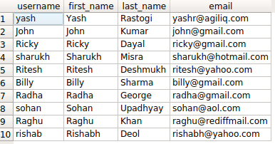

如何在Django ORM中使用 NOT 查询？
++++++++++++++++++++++++++++++++++++++++++++++++++

如果你正在使用 :code:`django.contrib.auth`，会发现有一个叫 :code:`auth_user` 的表。它包含 :code:`username` ，:code:`first_name` ， :code:`last_name` 等等字段。

假如你想要获取所有id不小于5的用户，你需一个NOT操作。

Django 提供了两种选择。

- :code:`exclude(<condition>)`
- :code:`filter(~Q(<condition>))`

详细查询语句
-----------------------

以上条件下的SQL查询语句如下所示：

.. code-block:: sql

    SELECT id, username, first_name, last_name, email FROM auth_user WHERE NOT id < 5;

方法一：使用exclude()方法

.. code-block:: python

    >>> queryset = User.objects.exclude(id__lt=5)
    >>> queryset
    <QuerySet [<User: Ritesh>, <User: Billy>, <User: Radha>, <User: sohan>, <User: Raghu>, <User: rishab>]>

方法二：使用Q()方法

    >>> from django.db.models import Q
    >>> queryset = User.objects.filter(~Q(id__lt=5))
    >>> queryst
    <QuerySet [<User: Ritesh>, <User: Billy>, <User: Radha>, <User: sohan>, <User: Raghu>, <User: rishab>]>

