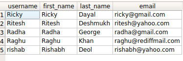

如何在Django ORM中使用 OR 查询？
++++++++++++++++++++++++++++++++++++++++++++++++++

.. image:: usertable.png

如果你正在使用 :code:`django.contrib.auth`，会发现有一个叫 :code:`auth_user` 的表。它包含 :code:`username`，:code:`first_name`， :code:`last_name` 等等字段。

常见的需求是在两个或多个条件下执行or筛选查询。比如说你想所有的用户的firstname以'R'开始或last name以'D'开始。 

Django 提供了两个选项。

- :code:`queryset_1 | queryset_2`
- :code:`filter(Q(<condition_1>)|Q(<condition_2>)`

- :code:`queryset_1 | queryset_2`
- :code:`filter(Q(<condition_1>)|Q(<condition_2>)`

详细查询语句
-----------------------

以上条件下的SQL查询语句如下所示：

.. code-block:: sql

    SELECT username, first_name, last_name, email FROM auth_user WHERE first_name LIKE 'R%' OR last_name LIKE 'D%';

相似地我们的orm查询语句会像这样：

.. code-block:: python

    queryset = User.objects.filter(
            first_name__startswith='R'
        ) | User.objects.filter(
        last_name__startswith='D'
    )
    queryset
    <QuerySet [<User: Ricky>, <User: Ritesh>, <User: Radha>, <User: Raghu>, <User: rishab>]>

查看下生成的SQL查询语句：

.. code-block:: python

    In [5]: str(queryset.query)
    Out[5]: 'SELECT "auth_user"."id", "auth_user"."password", "auth_user"."last_login",
    "auth_user"."is_superuser", "auth_user"."username", "auth_user"."first_name",
    "auth_user"."last_name", "auth_user"."email", "auth_user"."is_staff",
    "auth_user"."is_active", "auth_user"."date_joined" FROM "auth_user"
    WHERE ("auth_user"."first_name"::text LIKE R% OR "auth_user"."last_name"::text LIKE D%)'

或者，你也可以使用Q对象。

.. code-block:: python

    from django.db.models import Q
    qs = User.objects.filter(Q(first_name__startswith='R')|Q(last_name__startswith='D'))

检查下生成查询语句，你会发现结果是一致的。

.. code-block:: ipython

    In [9]: str(qs.query)
    Out[9]: 'SELECT "auth_user"."id", "auth_user"."password", "auth_user"."last_login",
     "auth_user"."is_superuser", "auth_user"."username", "auth_user"."first_name",
      "auth_user"."last_name", "auth_user"."email", "auth_user"."is_staff",
      "auth_user"."is_active", "auth_user"."date_joined" FROM "auth_user"
      WHERE ("auth_user"."first_name"::text LIKE R% OR "auth_user"."last_name"::text LIKE D%)'

